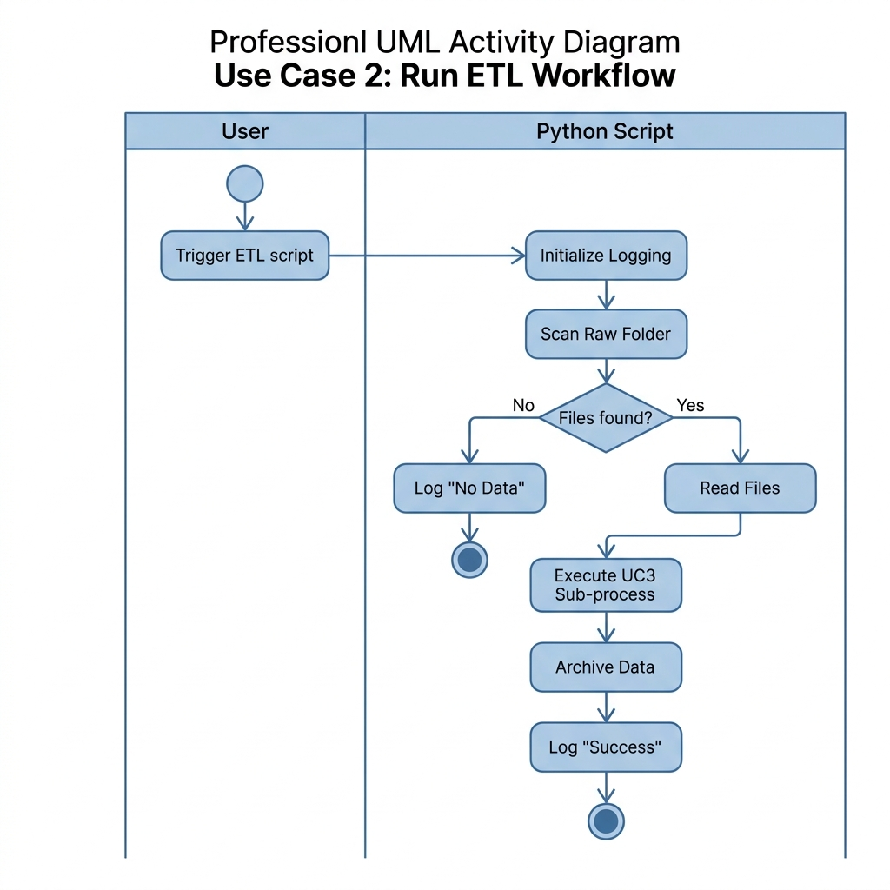
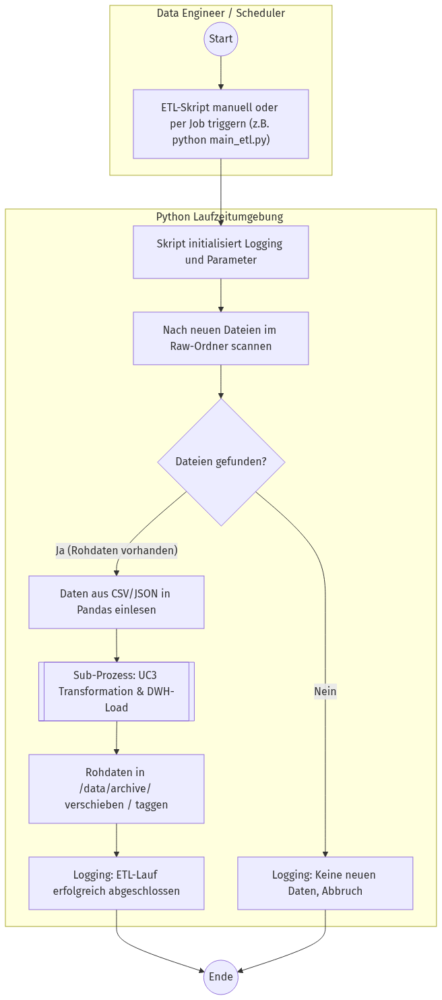
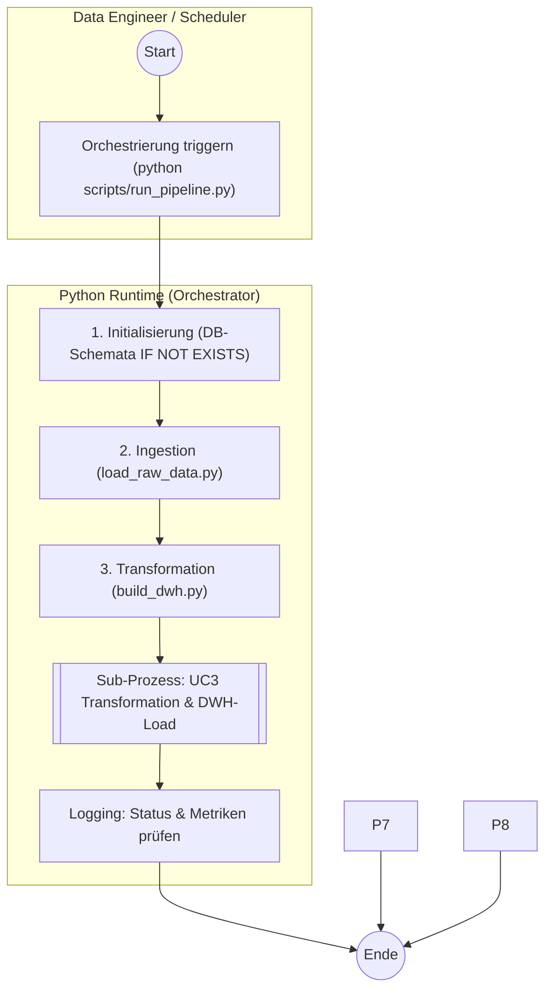

# Aktivitätsdiagramm (Whitebox): UC2 - ETL-Workflow ausführen

Dieses Diagramm zeigt den Start und die Ablauflogik des ETL-Hauptskripts. Da Use-Case 3 zwingend inkludiert ist, wird er hier als Sub-Prozess (Referenz) dargestellt.

