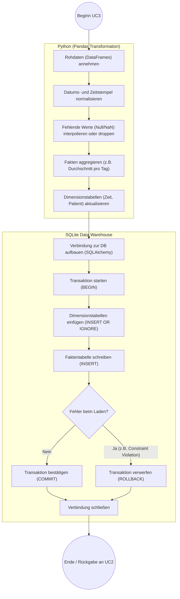

# Aktivitätsdiagramm (Whitebox): UC3 - Daten transformieren & in DWH integrieren

Dieses Diagramm zeigt im Detail, was innerhalb des in UC2 ausgelösten Sub-Prozesses beim Transformieren und Laden passiert, insbesondere die Interaktion zwischen Pandas und der SQLite-Datenbank.

