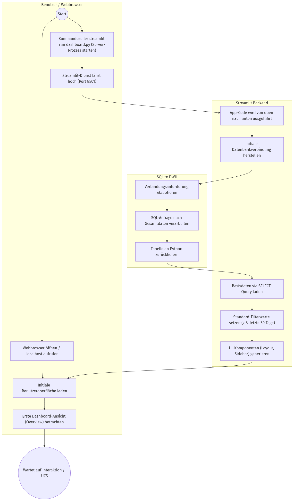
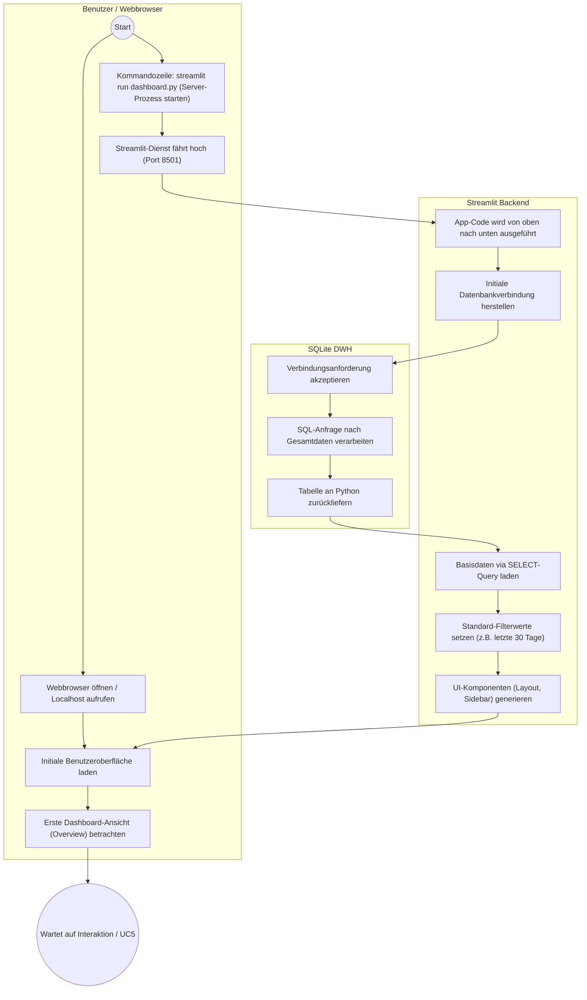

# Aktivitätsdiagramm (Whitebox): UC4 - Dashboard starten

Dieses Diagramm verdeutlicht die Architektur beim Starten der analytischen Oberfläche. Es repräsentiert die Initialisierung der Streamlit-Webanwendung und die erste Datenbereitstellung.

