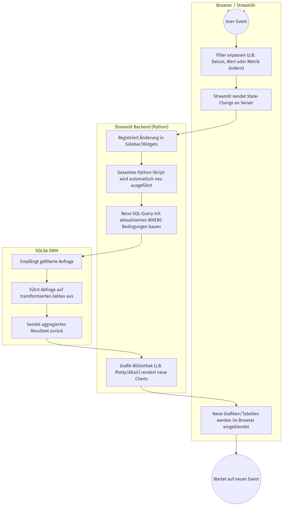
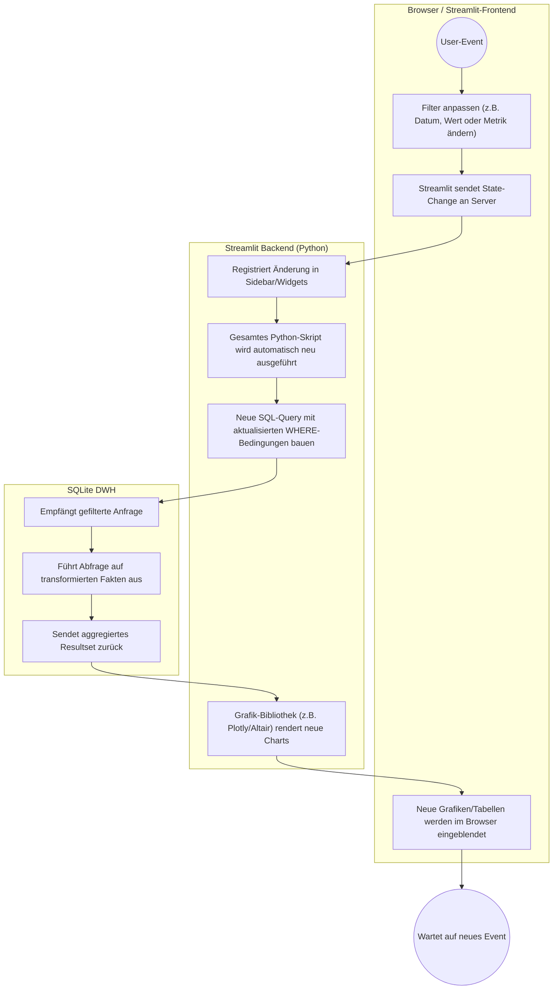

# Aktivitätsdiagramm (Whitebox): UC5 - Analysen interaktiv filtern & explorieren

Hier wird die reaktive Schleife gezeigt, die abläuft, wenn der Benutzer im laufenden Dashboard mit Filtern oder Grafiken interagiert.

