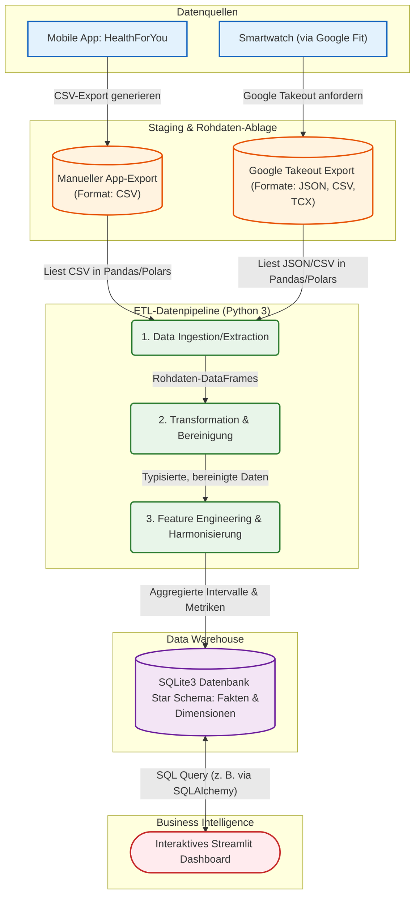

# Architektur-Übersicht: Health Monitoring Projekt

Das folgende Diagramm zeigt die Gesamtarchitektur des Data Engineering Projekts. 
Es veranschaulicht den Weg von den Datenquellen über die Extraktion und ETL-Verarbeitung bis hin zur Speicherung und Visualisierung. 

Das Setup basiert auf **Python 3** als primärer Programmiersprache für den gesamten ETL-Prozess und **SQLite3** für die persistente Datenhaltung im Data Warehouse.

## Datenquellen und Formate

1.  **HealthForYou App (Blutdruck & Medikation):** 
    *   **Methode:** Manueller Datenexport direkt aus der Applikation.
    *   **Format:** `CSV` (Comma-Separated Values). Enthält typischerweise Tabellenstrukturen mit definierten Spalten wie Datum, Uhrzeit, Systole, Diastole, Puls.
2.  **Google Fit / Smartwatch (Aktivitäts- & Bewegungsdaten):**
    *   **Methode:** Automatisierter/Manueller Export aller Gesundheits- und Fitnessdaten über den **Google Takeout** Dienst.
    *   **Formate:** 
        *   `JSON` (JavaScript Object Notation): Sehr tiefgreifende und komplexe Fitnessdaten (z. B. feingranulare Schritt-Aggregate, Schlafanalyse, tägliche Aktivitäts-Metriken) werden von Google Fit zumeist als unstrukturierte oder halbstrukturierte JSON-Dateien ausgegeben, oft iteriert in diversen Unterordnern.
        *   `CSV`: Standard-Aktivitäten-Metriken über den gesamten Export-Zeitraum liegen teilweise strukturiert vor.
        *   `TCX` (Training Center XML): Besonders detaillierte Einzel-Aufzeichnungen (wie bspw. ein konkreter Spaziergang oder Lauf mit GPS-Tracking) werden als XML-Struktur (TCX) mitgeliefert.

**Für dieses Projekt fokussieren wir uns bei Google Fit primär auf die Aufbereitung der `JSON`- sowie etwaiger `CSV`-Rohdaten.**

---

## Architekturdiagramm (Mermaid)

