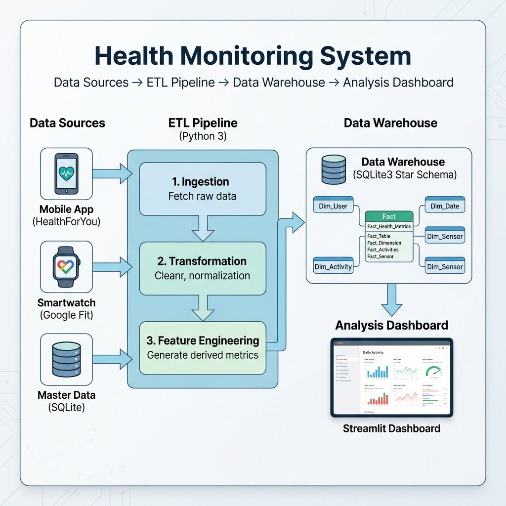
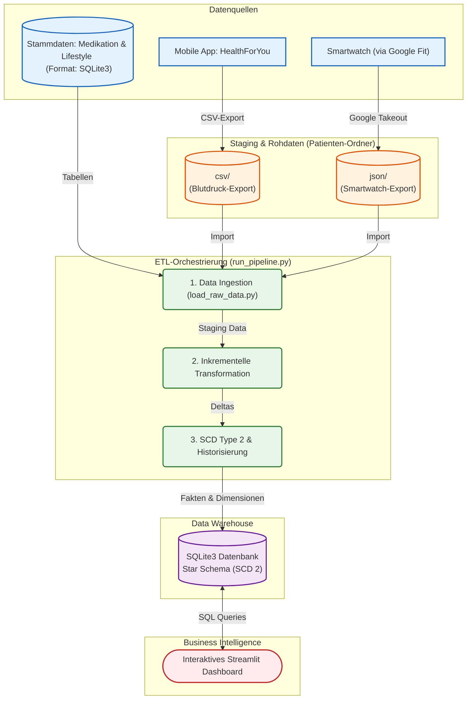

# Architektur-Übersicht: Health Monitoring Projekt

Das folgende Diagramm zeigt die Gesamtarchitektur des Data Engineering Projekts. 
Es veranschaulicht den Weg von den Datenquellen über die Extraktion und ETL-Verarbeitung bis hin zur Speicherung und Visualisierung. 

Das Setup basiert auf **Python 3** als primärer Programmiersprache für den gesamten ETL-Prozess und **SQLite3** für die persistente Datenhaltung im Data Warehouse.

### Aufbau der Rohdaten (`01_raw`)
Um mehrere Patienten zu unterstützen, werden die Daten in nutzerspezifischen Unterordnern gespeichert. Eine detaillierte Erläuterung der Verknüpfungslogik finden Sie in der [Datenquellen-Verknüpfung](file:///c:/Users/nilsb/OneDrive/Nils/weiterbildung/DataEngineer/Projektarbeit/Blutdruck/Architektur/Datenquellen_Verknuepfung.md).

## 1. Datenquellen und Formate

1.  **HealthForYou App (Blutdruck & Medikation):** 
    *   **Methode:** Manueller Datenexport direkt aus der Applikation.
    *   **Dateipfad:** `data/01_raw/patient_<ID>/csv/HealthForYouApp_DataExport.csv`
    *   **Format:** `CSV` (SVD-Werte: Systole, Diastole, Puls).
2.  **Google Fit / Smartwatch (Aktivitäts- & Bewegungsdaten):**
    *   **Methode:** Export aller Fitnessdaten über **Google Takeout**.
    *   **Dateipfad:** `data/01_raw/patient_<ID>/json/`
    *   **Formate:** `JSON` (detaillierte Schritte, Schlaf), `CSV` (Tageszusammenfassungen).
3.  **Master Data / Stammdaten (Medikation & Lifestyle):**
    *   **Methode:** Direkte Pflege und Bereitstellung über eine SQLite-Datenbank.
    *   **Format:** `SQLite3`. Enthält den Medikamenten-Katalog und benutzerspezifische Profile (Raucher status, Sport-Intensität).

---

## 2. Architekturdiagramm

