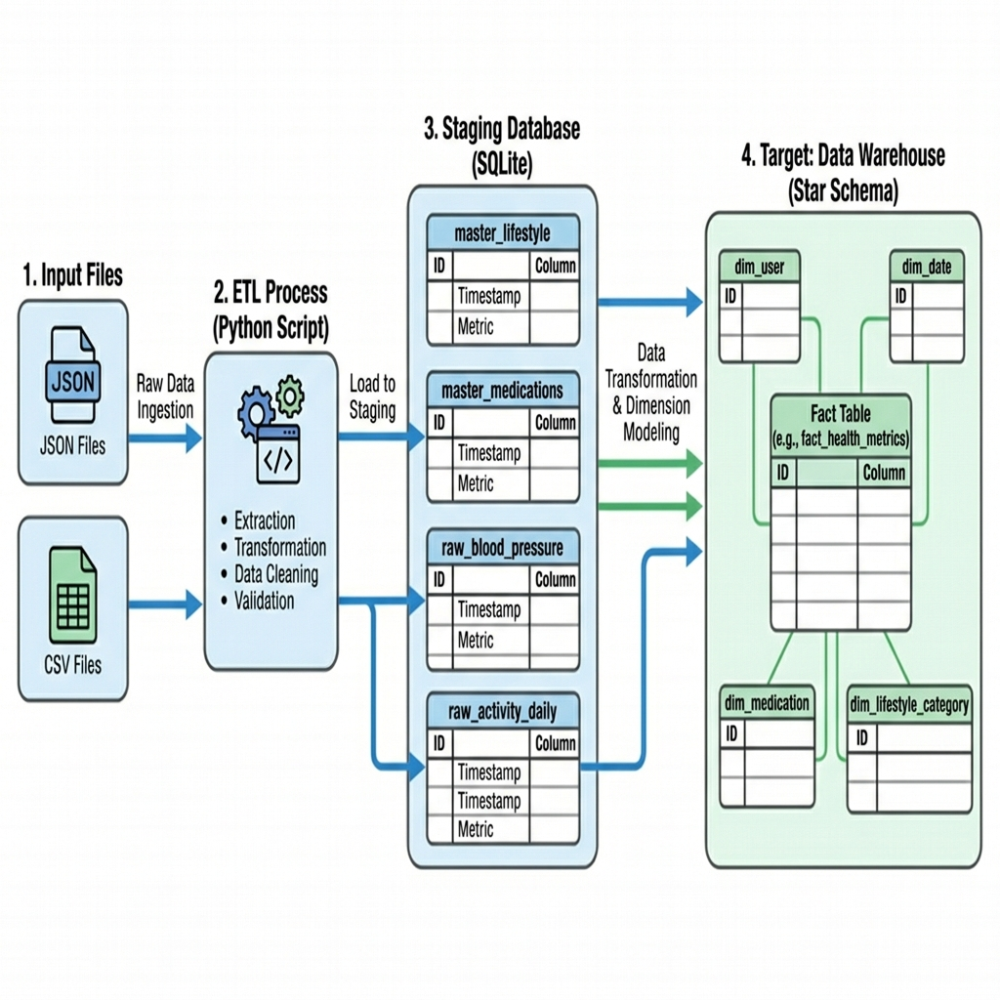
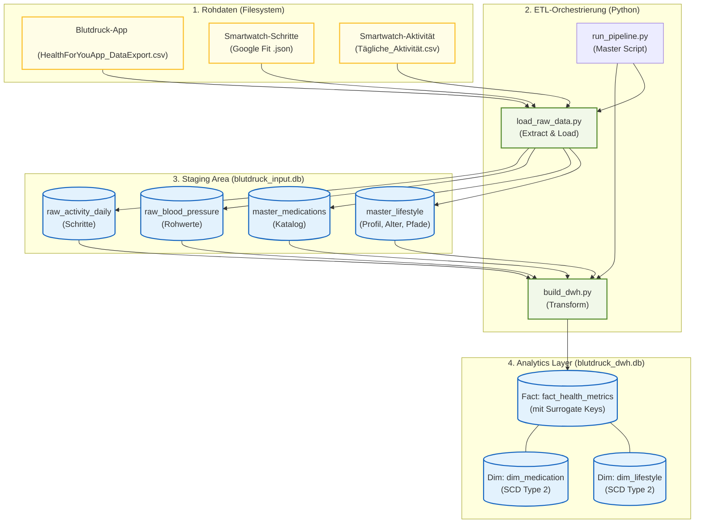

# Datenbank- & ETL-Übersicht

Diese Dokumentation beschreibt die Schichtenarchitektur der Blutdruck-Monitoring-Plattform, die verwendeten SQLite-Datenbanken und die ETL-Logik.

## 1. Datenfluss-Diagramm

---

## 2. Schichtenarchitektur

Die Daten fließen in drei Hauptschichten durch das System:

1.  **Raw Layer (Dateisystem)**: In Ordnern organisierte CSV- und JSON-Exporte (patient_001, etc.).
2.  **Staging Area (Ingestion / SQLite)**: `blutdruck_input.db`. Rohdaten-Import und Bereitstellung der Stammdaten.
3.  **Data Warehouse (Analytics / SQLite)**: `blutdruck_dwh.db` (Geplant). Optimiertes Star-Schema für Abfragen und Dashboards.

---

## 2. Staging Area (`blutdruck_input.db`)

Diese Datenbank dient der technischen Übernahme der Rohdaten. Hier findet noch keine Änderung der Granularität statt.

### Stammdaten (Master Data)
*   **`master_medications`**: Katalog aller verfügbaren Medikamente (Name, Dosis in mg).
*   **`master_lifestyle`**: Benutzerprofile (Alter, Raucher-Status, Bewegungstyp) sowie das dynamische Folder-Mapping (`raw_data_folder`).
*   **`user_medication_plan`**: Verknüpfung von Patient, Medikament und Einnahmezeitpunkt (morgens, abends, etc.).

### Rohdaten-Tabellen (Raw Area)
*   **`raw_blood_pressure`**: Importierte SVD-Werte (Systolisch, Diastolisch, Puls) mit Zeitstempel.
*   **`raw_activity_daily`**: Tägliche Zusammenfassung von Schritten, Gewicht und Aktivitätsminuten.

---

## 3. ETL-Skripte & Logik

Die Transformation wird durch Python-Skripte gesteuert:

*   **`init_db.py`**: Initialisiert das Schema und befüllt die Stammdaten aus den SQL-Dateien.
*   **`load_raw_data.py`**: 
    - **Metadata-driven**: Liest aus `master_lifestyle`, welche Patienten-Ordner existieren.
    - **Parsing**: Verarbeitet HealthForYou-CSVs (Blutdruck) und Google Fit-CSVs (Smartwatch).
    - **Transformation**: Normiert Zeitstempel auf ISO-Format (`YYYY-MM-DD HH:MM:SS`).

---

## 4. Zielzustand: Warehouse (DWH)

Das geplante Warehouse folgt dem **Star-Schema**, um komplexe Analysen zu beschleunigen (z.B. "Wie verhält sich der Blutdruck 2 Stunden nach der Tabletteneinnahme bei Bewegung?").

### Geplante Tabellen:
*   **`fact_health_metrics`**: Die zentrale Tabelle, die Blutdruck, Aktivität und Medikation auf Stunden- oder Tagesebene verknüpft.
*   **`dim_patient`**: Patienten-Dimension (Alter, Bewegungstyp).
*   **`dim_medication`**: Medikations-Dimension.
*   **`dim_time`**: Zeit-Dimension (Attribute wie Wochentag, Tageszeit-Cluster).

---

## 5. Speicherorte

*   Rohdaten: `data/01_raw/`
*   SQL-Skripte: `database/`
*   Datenbank-Dateien: `database/*.db`
*   Python-ETL: `scripts/`

