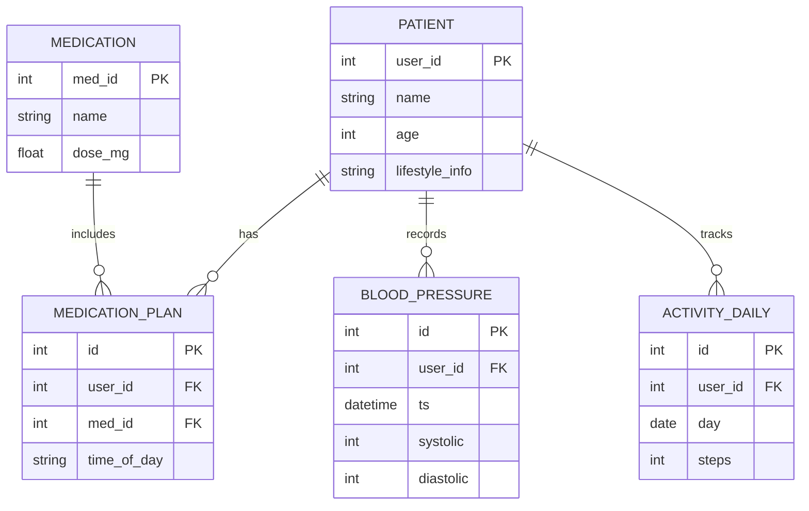
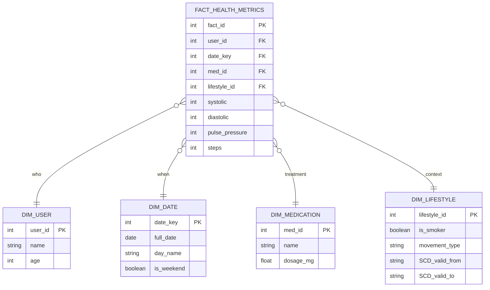

# Design-Dokumentation: Health Monitoring Plattform

Dieses Dokument beschreibt den Aufbau und die Datenstrategie für das Blutdruck-Monitoring. Es wird sauber zwischen dem **Dateneingang (Business-DB)** und dem **Auswertungs-Bereich (Data Warehouse)** getrennt.

---

## 1. Zielsetzung des Projekts

Das Ziel ist die Untersuchung von Blutdruck, Puls und Bewegung in Verbindung mit Medikamenten. 

### Die Fragen an die Daten:
*   Hat die Tablette (z.B. Ramipril) den Blutdruck in den ersten 4 Stunden wirklich gesenkt?
*   Helfen mehr Schritte am Tag dabei, den Ruhepuls zu senken?
*   Gibt es Unterschiede zwischen Werktagen (Stress?) und dem Wochenende?
*   **Historie**: Wie haben sich die Werte verändert, nachdem jemand angefangen hat, mehr Sport zu treiben?

---

## 2. Der Dateneingang (Business-DB / Staging)

Die `blutdruck_input.db` dient als Zwischenlager. Hier fließen die CSV-Exporte der App und die JSON-Files der Smartwatch zusammen.

### Ein Wort zum Speicherplatz (Kalkulation)
In einer Hochrechnung für **100 Leute über 5 Jahre** ergeben sich folgende Werte:
*   **Blutdruck**: 2 Messungen pro Tag = 365.000 Zeilen (ca. 22 MB).
*   **Aktivität**: 1 Eintrag pro Tag = 182.500 Zeilen (ca. 7 MB).
*   **Insgesamt**: Das Datenvolumen liegt bei ca. **50 MB** inklusive Indizes. Für SQLite ist das eine geringe Last und extrem performant.

### Datenbank-Design (Normalform)
Die Daten werden sauber getrennt gehalten. Patienten-Profile liegen in einer Tabelle, der Medikationsplan in einer anderen. Das spart Platz und verhindert, dass bei jeder Messung der Name des Patienten mitgeführt werden muss (Daten-Redundanz vermeiden).

### Datenmodell (ERM)

---

## 3. Der Auswertungs-Bereich (Data Warehouse)

Die `blutdruck_dwh.db` ist für die Analyse optimiert. Hierfür wird ein **Star-Schema** eingesetzt.

### Wie das funktioniert:
In der Mitte liegt eine große **Fakten-Tabelle** (`fact_health_metrics`). Drumherum liegen **Dimensionen** (Nutzer, Zeit, Medikamente, Lifestyle), die einfach per Join verknüpft werden können. Das ist viel schneller als im verzweigten Eingangs-Modell zu suchen.

### Star-Schema Modell (mER)

---

## 4. Wie kommen die Daten rüber? (ETL & Mapping)

Ein Python-Skript (`build_dwh.py`) liest den Eingang aus, berechnet den **Pulsdruck** (Differenz zwischen den Werten) und ordnet die Schritte dem richtigen Tag zu.

### ETL Mapping Tabelle (Detailliert)

| Quelle (Eingangs-DB) | Tabellen-Spalte | Ziel (DWH-DB) | Ziel-Spalte | Transformation / Logik |
| :--- | :--- | :--- | :--- | :--- |
| `raw_blood_pressure`| `systolic` | `fact_health_metrics` | `systolic` | Direkte Übernahme |
| `raw_blood_pressure`| `diastolic` | `fact_health_metrics` | `diastolic` | Direkte Übernahme |
| `raw_blood_pressure`| `pulse` | `fact_health_metrics` | `pulse` | Direkte Übernahme |
| `raw_blood_pressure`| `sys - dia` | `fact_health_metrics` | `pulse_pressure` | Berechnung des Pulsdrucks |
| `raw_blood_pressure`| `timestamp` | `fact_health_metrics` | `date_key` | Konvertierung zu YYYYMMDD (FK) |
| `raw_blood_pressure`| `timestamp` | `fact_health_metrics` | `time_key` | Extraktion der Uhrzeit (HH:MM) |
| `raw_activity_daily`| `steps` | `fact_health_metrics` | `steps_hourly` | Zuordnung zum Tag der Messung |
| `raw_activity_daily`| `weight_kg` | `fact_health_metrics` | `weight_kg` | Direkte Übernahme |
| `master_lifestyle` | `movement_type` | `dim_lifestyle` | `movement_type` | Übernahme des Aktivitätsstatus |
| `master_lifestyle` | `name`, `age` | `dim_user` | `name`, `age` | Stammdaten-Migration |
| `master_medications`| `name`, `dose_mg` | `dim_medication` | `name`, `dosage_mg` | Stammdaten-Migration |

---

## 5. Historie bewahren (SCD 2)

Das ist ein wichtiger Punkt im Data Engineering: Was passiert, wenn ein Patient sportlicher wird?

*   Wenn der Wert einfach überschrieben wird (SCD 1), sieht es im Zeitverlauf so aus, als ob der Status des Patienten *schon immer* aktuell war. Das verfälscht die historischen Blutdruckwerte.
*   Mit **SCD 2** wird eine neue Version des Datensatzes angelegt. Es ist somit genau ersichtlich: "Vom 01.01. bis 31.03. war der Status unsportlich, ab dem 01.04. sportlich".

### Technische Spalten:
Dazu werden zwei Zeitstempel genutzt:
*   `valid_from`: Ab wann gilt dieser Zustand?
*   `valid_to`: Bis wann galt dieser Zustand? (NULL = aktuell gültig).

---

## Anhang: Technische Modelle (Mermaid)

*Hier liegen die Quellcodes für die Diagramme, falls du sie später für die Doku anpassen oder in ein anderes Format exportieren willst.*

### ERM (Business-DB)

### mER (Star-Schema)

