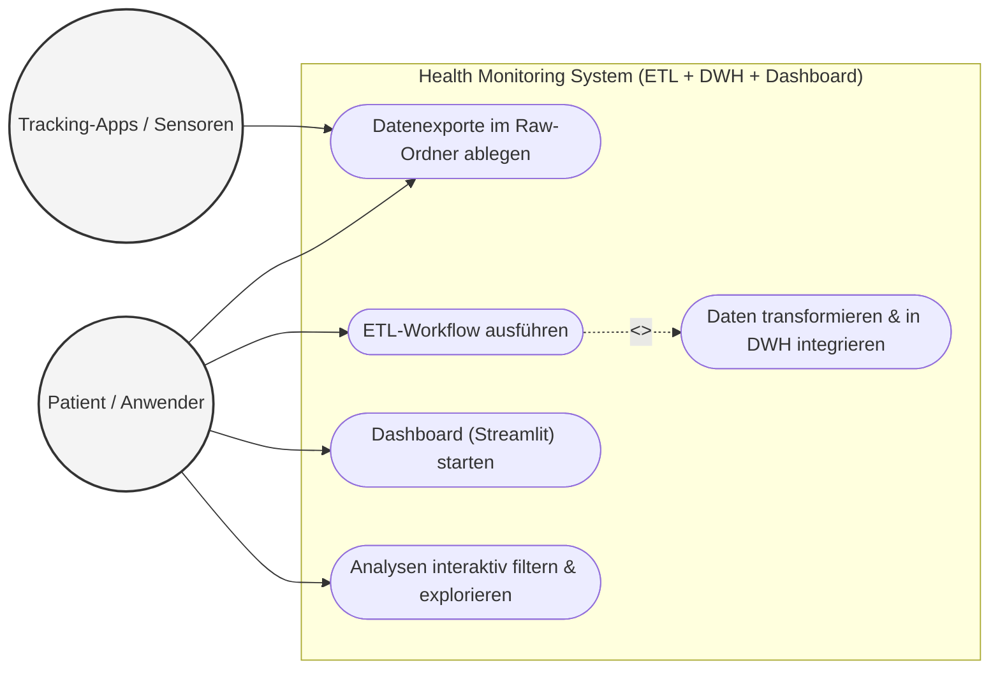

# Use-Case-Diagramm: Health Monitoring (Blutdruck & Aktivität)

Dieses Modell beschreibt die funktionalen Hauptanwendungsfälle deines Data-Engineering-Projekts aus der Perspektive der interagierenden Akteure.

## 1. Übersicht der Akteure
* **Patient / Data Engineer:** Die handelnde Person, die Daten zur Verfügung stellt, den Pipeline-Prozess überwacht und das analytische Dashboard konsumiert.
* **Sensoren / Tracking-Apps (Externes System):** Geräte wie das Blutdruckmessgerät und die Smartwatch, die Rohdaten erzeugen.

---

## 2. UML Use-Case Diagramm (Mermaid)

---

## 3. Beschreibung der Anwendungsfälle (Use-Cases)

| Use-Case | Kurzbeschreibung |
| :--- | :--- |
| **Datenexporte ablegen** | Die Rohdaten (CSV/JSON) werden durch den Akteur oder das Sensorsystem periodisch in der definierten Ablagestruktur generiert und bereitgestellt. |
| **ETL-Workflow ausführen** | Der Anwender startet (manuell oder zeitgesteuert) das Master-Skript der Datenpipeline. |
| **Daten transformieren & integrieren** | Innerhalb des Workflows reinigt das System automatisch die Zeitleisten, reichert die Features an und schreibt die aggregierten Fakten ins DWH (Star-Schema). *Die Ausführung des ETL-Workflows inkludiert diesen Schritt zwingend (`<<includes>>`).* |
| **Dashboard starten** | Der Anwender ruft die Streamlit-Webanwendung auf, die sich direkt mit dem lokalen Data Warehouse verbindet. |
| **Analysen filtern & explorieren** | Der Anwender justiert Betrachtungszeiträume, filtert nach Metriken (z. B. "nur hohe Inaktivität") und analysiert die grafischen Korrelationen zwischen Medikamenten, Blutdruck und Bewegung. |
