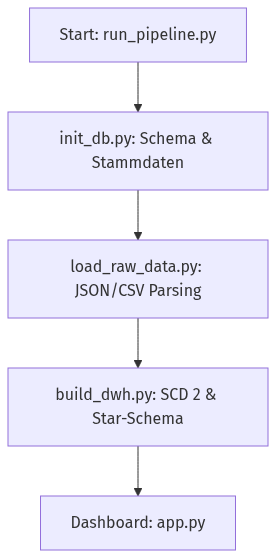

# Zentrale Dokumentation: Health Monitoring Data Pipeline {#mainpage}

Willkommen in der technischen Dokumentation des Health Monitoring Projekts. Dieses System wurde entwickelt, um Blutdruck-, Aktivitäts- und Medikationsdaten von Patienten zu integrieren, zu historisieren und zu visualisieren.

## Systemüberblick

Die Pipeline folgt dem klassischen **ETL-Muster** (Extract, Transform, Load) und nutzt ein **Star-Schema** im Data Warehouse zur effizienten Analyse.

### 1. Datenquellen (Quellen)
- **HealthForYou App**: CSV-Exporte der Blutdruckmessungen.
- **Smartwatch (Google Fit)**: JSON/CSV-Exporte der täglichen Aktivitäten.
- **Master Data**: JSON-basierte Nutzerprofile und SQL-basierte Medikamentenkataloge.

### 2. Der ETL-Prozess
Der Prozess wird zentral über das Skript `scripts/run_pipeline.py` gesteuert.

- **Initialisierung**: Vorbereitung der Datenbank-Strukturen (`scripts/init_db.py`).
- **Ingestion**: Laden der Rohdaten in die Staging-Area (`scripts/load_raw_data.py`).
- **Transformation**: Historisierung nach SCD Type 2 und Überführung ins Star-Schema (`scripts/build_dwh.py`).

## Programmablauf (High-Level)

## Technische Komponenten
Weitere Details zu den einzelnen Modulen finden Sie in den entsprechenden Sektionen:
- \subpage scripts
- \subpage transformations
- \subpage analytics

@date 2026-04-08
